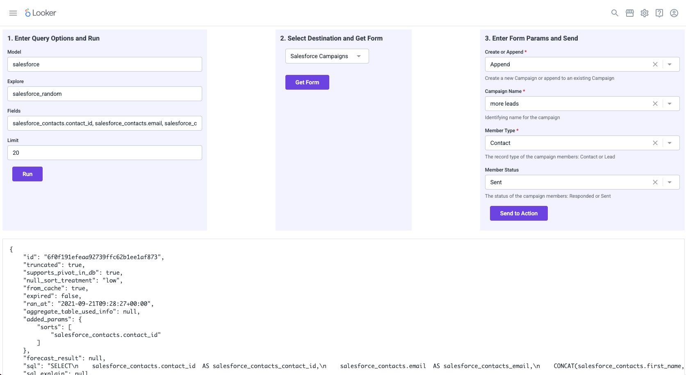

# Simple Extension Example for Oauth Enabled Actions

## Local development

1. Create new LookML project. Copy `manifest.lkml` and create a new model file
1. Deploy project to production
1. `yarn install`
1. `yarn develop`
